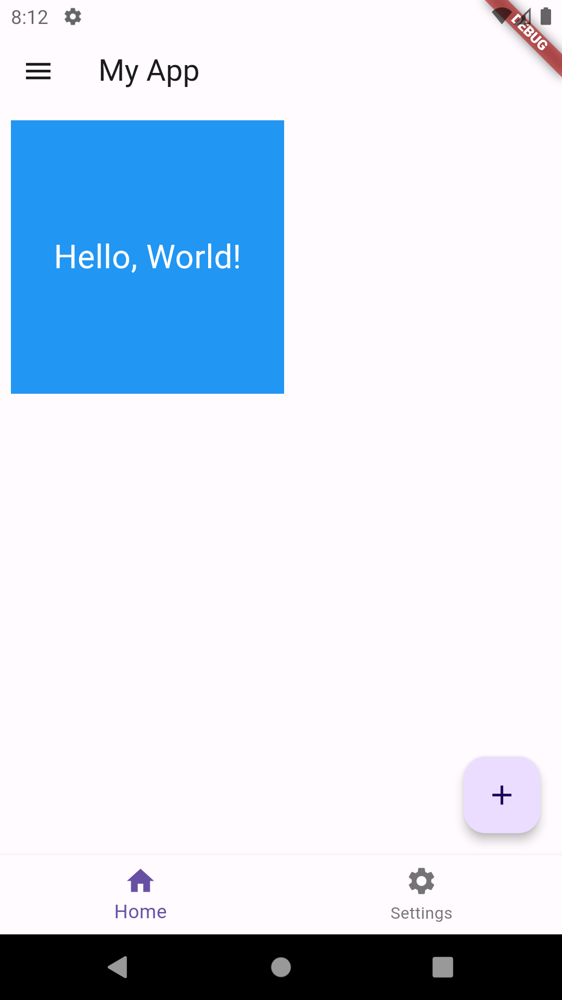

# Widget

_"Everything is Widget"_ - ใน Flutter เกือบทุกอย่างเป็น Widget ที่นำมาประกอบกันเป็นส่วนให้แสดงผลบนหน้าจอ เช่น โครงสร้าง, ปุ่ม, ข้อความ, รูปภาพ, ไอคอน และอื่นๆ Widget เป็นส่วนประกอบพื้นฐานในการสร้าง UI ของแอป Flutter

**ประเภทของ Widget**

1. Stateless Widget: เป็น widget ที่ไม่มีการเปลี่ยนแปลงสถานะภายใน (immutable) เหมาะสำหรับการแสดงผลคงที่ ไม่ขึ้นกับข้อมูลที่เปลี่ยนแปลง
2. Stateful Widget: เป็น widget ที่มีการเปลี่ยนแปลงสถานะภายใน (mutable) เหมาะสำหรับการแสดงผลที่ขึ้นกับข้อมูลที่เปลี่ยนแปลงไป เช่น ข้อมูลจากผู้ใช้หรือ API

### Stateless Widget

**StatelessWidget** คือ Widget ที่ไม่มีการจัดการ state ภายใน (immutable state) นั่นคือ properties และลักษณะที่แสดงผลของ widget จะถูกกำหนดตั้งแต่ตอนสร้าง และจะคงที่ไม่เปลี่ยนแปลงตลอดช่วงเวลาที่ widget ถูกแสดงผลบนหน้าจอ

StatelessWidget เหมาะสำหรับ UI components ที่ไม่ซับซ้อน ไม่มีการเปลี่ยนแปลงข้อมูลหรือ state จากภายใน เช่น:

- ข้อความ, ไอคอน, รูปภาพ ที่แสดงแบบคงที่
- ปุ่มที่มี label และ icon คงที่
- การจัดวาง (layout) widgets แบบคงที่ เช่น Row, Column, Container
- Custom widgets ที่ combine widgets พื้นฐานต่างๆ เป็น component แบบคงที่

ข้อดีของ StatelessWidget คือมีโครงสร้างที่เรียบง่าย เขียนโค้ดน้อย และมีประสิทธิภาพในการ render สูง เพราะไม่ต้องมีการจัดการ state ภายใน ทำให้เหมาะกับ UI ส่วนที่ไม่ซับซ้อนและแสดงผลคงที่

ในการสร้าง StatelessWidget เราจะสร้าง class ที่ extends จาก `StatelessWidget` และ implement เมธอด `build()` ซึ่งทำหน้าที่คืนค่า widget ที่ต้องการให้แสดงผล โดย widget ที่คืนมักจะเป็นการ combine widgets พื้นฐานต่างๆ ผ่านการจัดวางใน layout widgets เช่น Row, Column, Stack เป็นต้น

ตัวอย่างโค้ดการสร้าง StatelessWidget:

```dart
class MyCard extends StatelessWidget {
  final String title;
  final String subtitle;

  const MyCard({required this.title, required this.subtitle});

  @override
  Widget build(BuildContext context) {
    return Card(
      child: Padding(
        padding: EdgeInsets.all(16.0),
        child: Column(
          crossAxisAlignment: CrossAxisAlignment.start,
          children: [
            Text(title, style: TextStyle(fontSize: 24, fontWeight: FontWeight.bold)),
            SizedBox(height: 8),
            Text(subtitle, style: TextStyle(fontSize: 18)),
          ],
        ),
      ),
    );
  }
}
```

ในตัวอย่างนี้ เราสร้าง MyCard widget ที่แสดงข้อความ title และ subtitle ภายใน Card โดยจัดวางด้วย Column และกำหนดลักษณะตัวอักษรผ่าน TextStyle

การใช้งาน MyCard widget สามารถทำได้โดย:

```dart
MyCard(
  title: 'Flutter is awesome',
  subtitle: 'A powerful and flexible UI framework',
)
```

ซึ่ง MyCard จะแสดงผลเป็น Card ที่ประกอบด้วยข้อความและจัดรูปแบบตามที่กำหนดใน `build()` method โดยไม่มีการเปลี่ยนแปลง state ภายในตัว widget เอง

### Lifecycle ของ StatelessWidget

Lifecycle ของ StatelessWidget นั้นค่อนข้างเรียบง่าย เนื่องจากมันไม่มีการจัดการ state ภายใน ดังนั้นจึงไม่จำเป็นต้องมีเมธอดพิเศษต่างๆ ที่เกี่ยวข้องกับการจัดการ state

Lifecycle หลักๆ ของ StatelessWidget ประกอบด้วย:

1. **Constructor**
   - เมื่อสร้าง instance ของ StatelessWidget constructor จะถูกเรียกเพื่อกำหนดค่า properties ต่างๆ ให้กับ widget
   - ใน constructor เราสามารถรับ parameter ที่จำเป็นสำหรับการสร้าง widget ได้ เช่น ข้อความ สี ขนาด ฯลฯ
2. **build()**
   - หลังจากสร้าง instance แล้ว Flutter framework จะเรียกเมธอด `build()` เพื่อสร้าง widget tree ตาม logic ที่เขียนไว้
   - ภายใน `build()` เราจะกำหนด widget ย่อยๆ ที่ประกอบกันเป็น widget หลัก โดยอาจมีการกำหนดค่าต่างๆ ผ่าน properties ของ sub-widgets เหล่านั้น
   - เมธอด `build()` จะถูกเรียกซ้ำเมื่อ parent widget มีการเปลี่ยนแปลงและต้องการ rebuild child widgets ใหม่
3. **Destroyed**
   - เมื่อ StatelessWidget ถูกลบออกจาก widget tree หรือถูกแทนที่ด้วย widget อื่น instance ของมันจะถูกกำจัดออกจากหน่วยความจำโดยอัตโนมัติ
   - ไม่จำเป็นต้องมีการเคลียร์หรือจัดการ resource ใดๆ เพิ่มเติม เนื่องจาก StatelessWidget ไม่มีการจัดการ state ใดๆ ด้วยตัวเอง

ตัวอย่างโค้ดแสดง lifecycle ของ StatelessWidget อย่างง่าย:

```dart
class MyWidget extends StatelessWidget {
  final String text;

  MyWidget({required this.text}) {
    print('Constructor called');
  }

  @override
  Widget build(BuildContext context) {
    print('Build called');
    return Text(text);
  }
}
```

เมื่อใช้งาน `MyWidget` ในโค้ด จะมีการพิมพ์ข้อความตาม lifecycle ดังนี้:

```
Constructor called
Build called
```

โดย constructor จะถูกเรียกตอนสร้าง instance ของ `MyWidget` และ `build()` จะถูกเรียกตามมาเพื่อสร้าง widget ย่อยตามที่กำหนดไว้

จะเห็นว่า lifecycle ของ StatelessWidget นั้นไม่ซับซ้อน เพราะมีเพียงการ build widget ด้วย `build()` โดยไม่ต้องสนใจเรื่องการจัดการ state ภายใน ทำให้เหมาะสำหรับการสร้าง UI components ที่ไม่มีการเปลี่ยนแปลงใดๆ ในตัวเอง

### StatefulWidget

**StatefulWidget** คือ Widget ที่มีการจัดการ state ภายใน (mutable state) ซึ่ง state นี้สามารถเปลี่ยนแปลงค่าได้ตลอดช่วงเวลาที่ widget ถูกแสดงผลบนหน้าจอ เมื่อ state มีการเปลี่ยนแปลง Flutter framework จะทำการ rebuild widget ใหม่โดยอัตโนมัติเพื่ออัปเดตหน้าตาให้สอดคล้องกับ state ล่าสุด

StatefulWidget เหมาะสำหรับ UI ที่มีการเปลี่ยนแปลง state ไม่ว่าจากการโต้ตอบของผู้ใช้ (user interaction) หรือจากการทำงานภายใน เช่น:

- ฟอร์มที่มี input fields ต่างๆ ที่ผู้ใช้สามารถแก้ไขข้อมูลได้
- ปุ่มที่เปลี่ยนสถานะ เช่น ปุ่มที่กดแล้วเปลี่ยนข้อความจาก "Follow" เป็น "Unfollow"
- วิดเจ็ตที่แสดงข้อมูลแบบเรียลไทม์ เช่น นาฬิกา หรือ live feed
- วิดเจ็ตที่มีการเล่นแอนิเมชันต่างๆ

ในการสร้าง StatefulWidget จะแบ่งเป็น 2 ส่วนหลักๆ คือ:

1. Class ที่ extends StatefulWidget ซึ่งเป็นส่วนของ widget ที่ immutable
2. Class ที่ extends State ซึ่งเป็นส่วนของ state ที่ mutable

ใน State class จะประกอบด้วย:

- ตัวแปรต่างๆ ที่เป็น state ของ widget
- เมธอด `initState()` ที่ใช้ตอนสร้าง State ครั้งแรก เช่น กำหนดค่าเริ่มต้นให้กับตัวแปร
- เมธอด `build()` ที่คืนค่า widget ตาม state ปัจจุบัน (เหมือนใน StatelessWidget)
- เมธอด `setState()` ที่ใช้เมื่อต้องการเปลี่ยนแปลง state และสั่งให้ Flutter rebuild widget

ตัวอย่างโค้ดการสร้าง StatefulWidget:

```dart
class Counter extends StatefulWidget {
  @override
  _CounterState createState() => _CounterState();
}

class _CounterState extends State<Counter> {
  int _count = 0;

  void _incrementCount() {
    setState(() {
      _count++;
    });
  }

  @override
  Widget build(BuildContext context) {
    return Column(
      mainAxisAlignment: MainAxisAlignment.center,
      children: [
        Text('Count: $_count'),
        ElevatedButton(
          onPressed: _incrementCount,
          child: Text('Increment'),
        ),
      ],
    );
  }
}
```

ในตัวอย่างนี้ เราสร้าง Counter widget ที่แสดงค่า count ปัจจุบัน และมีปุ่ม Increment เพื่อเพิ่มค่า count

- ใน `_CounterState` เรามีตัวแปร `_count` เป็น state ส่วน `_incrementCount()` คือฟังก์ชันที่เรียกเมื่อกดปุ่ม ซึ่งจะใช้ `setState()` ในการเพิ่มค่า `_count` และสั่ง rebuild widget
- ใน `build()` จะคืนค่าเป็น Column ที่มี Text แสดงค่า count และปุ่ม Increment ที่เรียก `_incrementCount` เมื่อถูกกด

การใช้งาน Counter widget สามารถทำได้โดย:

```dart
Counter()
```

ซึ่ง Counter จะแสดงเป็นข้อความ "Count: 0" และปุ่ม Increment ที่สามารถกดเพื่อเพิ่มค่า count ได้ โดยทุกครั้งที่กดปุ่ม widget จะถูกสร้างใหม่และอัปเดตข้อความให้แสดงค่า count ล่าสุด

### Lifecycle ของ StatefulWidget


**Lifecycle ของ StatefulWidget** ประกอบด้วยเหตุการณ์และเมธอดต่างๆ ที่ถูกเรียกโดย Flutter framework ตั้งแต่การสร้าง widget จนถึงการทำลายทิ้ง ซึ่งเราสามารถ override เมธอดเหล่านี้เพื่อเพิ่ม logic การทำงานในช่วงเวลาต่างๆ ได้

1. **createState()**
   - เมื่อสร้าง instance ของ StatefulWidget เมธอด `createState()` จะถูกเรียกเพื่อสร้าง instance ของ State object ที่เชื่อมโยงกับ widget นั้น
   - ใน `createState()` เราต้อง return instance ของ State class ที่เราสร้างขึ้นมา
2. **initState()**
   - หลังจากสร้าง State object แล้ว เมธอด `initState()` จะถูกเรียกเพียงครั้งเดียวเพื่อเริ่มต้นค่า state ต่างๆ ของ widget
   - เราสามารถใช้ `initState()` ในการกำหนดค่าเริ่มต้นให้กับตัวแปร เรียก API เพื่อดึงข้อมูล หรือเริ่มต้น listener ต่างๆ ได้
   - ต้องเรียก `super.initState()` ก่อนเสมอเมื่อ override `initState()`
3. **didChangeDependencies()**
   - หลังจาก `initState()` ทำงานเสร็จ เมธอด `didChangeDependencies()` จะถูกเรียกทันที
   - เมธอดนี้จะถูกเรียกซ้ำเมื่อมีการเปลี่ยนแปลง dependencies ของ widget เช่น เมื่อ InheritedWidget มีการเปลี่ยนแปลง
   - เราสามารถใช้ `didChangeDependencies()` ในการอัปเดตค่า state ที่ขึ้นกับ dependencies ได้
4. **build()**
   - เมื่อ State object พร้อมใช้งานแล้ว Flutter framework จะเรียกเมธอด `build()` เพื่อสร้าง widget tree ตาม state ปัจจุบัน
   - `build()` จะถูกเรียกซ้ำเมื่อมีการเปลี่ยนแปลง state ผ่านเมธอด `setState()` หรือเมื่อต้องมีการ rebuild widget ใหม่
5. **didUpdateWidget()**
   - เมื่อ StatefulWidget มีการเปลี่ยนแปลง configuration (เช่น properties ของมัน) `didUpdateWidget()` จะถูกเรียกที่ State object เดิม
   - เราสามารถเปรียบเทียบ widget เก่ากับใหม่ และอัปเดต state ตามการเปลี่ยนแปลงได้ใน `didUpdateWidget()`
6. **setState()**
   - เมื่อต้องการเปลี่ยนแปลง state ภายใน StatefulWidget ให้เรียกเมธอด `setState()` พร้อมด้วย callback ที่อัปเดตค่า state
   - หลังจาก `setState()` ทำงานเสร็จ Flutter framework จะเรียก `build()` อีกครั้งเพื่ออัปเดต UI ให้สอดคล้องกับ state ใหม่
7. **deactivate()**
   - เมื่อ State object ถูกลบออกจาก widget tree ชั่วคราว (เช่นเมื่อมีการเปลี่ยนหน้า) `deactivate()` จะถูกเรียก
   - เราสามารถใช้ `deactivate()` เพื่อจัดการ resources หรือยกเลิก listeners ที่ไม่จำเป็นชั่วคราวได้
8. **dispose()**
   - ก่อนที่ State object จะถูกลบออกจากหน่วยความจำอย่างถาวร (เช่นเมื่อปิดหน้าจอ) `dispose()` จะถูกเรียก
   - เราต้องใช้ `dispose()` ในการเคลียร์ resources ต่างๆ เช่นปิด streams ยกเลิก timers หรือ listeners เพื่อป้องกัน memory leaks
   - ต้องเรียก `super.dispose()` เสมอเมื่อ override `dispose()`

ตัวอย่างโค้ดเบื้องต้นของ StatefulWidget lifecycle:

```dart
class MyWidget extends StatefulWidget {
  @override
  _MyWidgetState createState() => _MyWidgetState();
}

class _MyWidgetState extends State<MyWidget> {
  int _counter = 0;

  @override
  void initState() {
    super.initState();
    print('initState() called');
  }

  @override
  void didChangeDependencies() {
    super.didChangeDependencies();
    print('didChangeDependencies() called');
  }

  @override
  void didUpdateWidget(covariant MyWidget oldWidget) {
    super.didUpdateWidget(oldWidget);
    print('didUpdateWidget() called');
  }

  @override
  void deactivate() {
    super.deactivate();
    print('deactivate() called');
  }

  @override
  void dispose() {
    super.dispose();
    print('dispose() called');
  }

  void _incrementCounter() {
    setState(() {
      _counter++;
      print('setState() called');
    });
  }

  @override
  Widget build(BuildContext context) {
    print('build() called');
    return Column(
      children: [
        Text('Count: $_counter'),
        ElevatedButton(
          onPressed: _incrementCounter,
          child: Text('Increment'),
        ),
      ],
    );
  }
}
```

เมื่อเราใช้ widget `MyWidget` ในแอป Flutter ผลลัพธ์ของ lifecycle methods ที่ถูกเรียกและลำดับของมันจะเป็นดังนี้:

1. เมื่อสร้าง `MyWidget` ครั้งแรก:

   ```
   initState() called
   didChangeDependencies() called
   build() called
   ```

2. เมื่อกดปุ่ม "Increment":

   ```
   setState() called
   build() called
   ```

3. เมื่อมีการอัปเดต parent widget ที่ครอบ `MyWidget` อยู่ (เช่นเมื่อ rebuild จาก `setState()` ของ parent):

   ```
   didUpdateWidget() called
   build() called
   ```

4. เมื่อ `MyWidget` ถูกลบออกจาก widget tree ชั่วคราว (เช่นเมื่อเปลี่ยนไปแสดง route อื่น):

   ```
   deactivate() called
   ```

5. เมื่อกลับมาแสดง `MyWidget` อีกครั้งหลังจาก deactivate:

   ```
   build() called
   ```

6. เมื่อลบ `MyWidget` ออกจาก widget tree อย่างถาวร (เช่นเมื่อปิดหน้าจอหรือ pop route ออก):
   ```
   deactivate() called
   dispose() called
   ```

โดยสังเกตว่า:

- `initState()`, `didChangeDependencies()` และ `dispose()` จะถูกเรียกเพียงครั้งเดียวตลอด lifecycle ของ widget
- `didUpdateWidget()` จะถูกเรียกเมื่อมีการเปลี่ยนแปลงบาง properties ของ widget จาก parent (เช่นเมื่อ parent rebuild)
- `build()` จะถูกเรียกหลังจากเมธอดต่างๆ ที่เกี่ยวข้องกับการเปลี่ยนแปลง state หรือ configuration ของ widget เพื่ออัปเดต UI ให้สอดคล้องกับ state ล่าสุด
- `deactivate()` อาจถูกเรียกหลายครั้งหากมีการซ่อนและแสดง widget บ่อยๆ แต่ `dispose()` จะเรียกเพียงครั้งเดียวตอนลบ widget ทิ้งเท่านั้น

อย่างไรก็ตาม ผลลัพธ์ที่แท้จริงอาจแตกต่างกันไปบ้างขึ้นอยู่กับว่า `MyWidget` ถูกใช้งานร่วมกับ widget อื่นๆ อย่างไร และมีการจัดการ state ของแอปเป็นอย่างไร แต่ลำดับพื้นฐานของ lifecycle ก็จะเป็นไปตามที่กล่าวไว้ข้างต้น

### Widget Tree

Widget Tree คือการนำ Widget มาซ้อนกันเป็นแบบแผนผังต้นไม้ โดย widget ที่บรรจุ widget อื่น ๆ เรียกว่า "parent widget" และ widget ที่อยู่ใน widget อื่น ๆ เรียกว่า "child widget"

ตัวอย่างโครงสร้าง Widget Tree เบื้องต้น:

```
MaterialApp
  ├── Scaffold
  │   ├── AppBar
  │   └── Center
  │       └── Text
  └── FloatingActionButton
```

ในตัวอย่างนี้ `MaterialApp` เป็น root widget ที่ครอบ `Scaffold` ซึ่งเป็น parent widget ของ `AppBar`, `Center` และ `FloatingActionButton` ส่วน `Text` เป็น child widget ของ `Center`

การสร้าง Widget Tree ที่มีประสิทธิภาพ ควรแบ่งเป็น widget ย่อยๆ ตามหน้าที่และความรับผิดชอบ ไม่ควรรวมโค้ดไว้ที่ widget เดียวจนเกินไป เพื่อให้อ่านเข้าใจง่ายและสามารถนำ widget ไปใช้ซ้ำได้

## Widget พื้นฐานของ Flutter

Widget พื้นฐานของ Flutter ที่มักจะใช้งานในการพัฒนาแอปพลิเคชันมีดังนี้

## MaterailApp


MaterialApp เป็น widget ระดับบนสุดที่ใช้ในการสร้าง application ด้วย Flutter โดยมีหน้าที่หลักในการตั้งค่าและกำหนดรูปแบบให้กับ app ตามแนวทางของ Material Design

คุณสมบัติสำคัญของ MaterialApp ได้แก่:

1. `title` - ชื่อของ app ที่แสดงบน task manager หรือ app switcher
2. `theme` - กำหนด theme ให้กับ app เช่น สี, font, shape ต่างๆ โดยใช้ ThemeData
3. `home` - กำหนดหน้า (screen) แรกที่แสดงเมื่อเปิด app
4. `routes` - กำหนด named routes สำหรับการนำทางไปยังหน้าต่างๆ ภายใน app
5. `initialRoute` - กำหนด route เริ่มต้นสำหรับการนำทาง ถ้าไม่ได้กำหนดจะใช้หน้าจาก `home`
6. `onGenerateRoute` - สร้าง route ในระหว่าง runtime ด้วย RouteSettings
7. `debugShowMaterialGrid`, `showSemanticsDebugger` - แสดงตาราง grid และข้อมูล semantics เพื่อช่วยในการออกแบบ layout
8. `locale`, `localizationsDelegates`, `supportedLocales` - ตั้งค่าที่เกี่ยวข้องกับ localization

ตัวอย่างโครงสร้างพื้นฐานของการใช้งาน MaterialApp:

```dart
import 'package:flutter/material.dart';

void main() {
  runApp(MyApp());
}

class MyApp extends StatelessWidget {
  @override
  Widget build(BuildContext context) {
    return MaterialApp(
      title: 'My Flutter App',
      theme: ThemeData(
        primarySwatch: Colors.blue,
      ),
      home: MyHomePage(),
    );
  }
}

class MyHomePage extends StatelessWidget {
  @override
  Widget build(BuildContext context) {
    return Scaffold(
      appBar: AppBar(
        title: Text('Home Page'),
      ),
      body: Center(
        child: Text('Hello, World!'),
      ),
    );
  }
}
```

ในตัวอย่างด้านบน MaterialApp ถูกใช้เป็น root widget ที่ครอบ MyHomePage ซึ่งเป็นหน้าหลักของ app โดย MaterialApp จะจัดการเรื่อง theme, title และ home widget ให้

นอกจาก MaterialApp แล้ว Flutter ยังมี CupertinoApp ซึ่งเป็น widget สำหรับสร้าง app ตามแบบ iOS ที่มีโครงสร้างและคุณสมบัติคล้ายกับ MaterialApp

สรุปคือ MaterialApp เป็นจุดเริ่มต้นในการสร้าง app ด้วย Flutter ที่มี design ตามแนวทาง Material ช่วยจัดการเรื่องพื้นฐาน เช่น routing, theming, localization ให้ เราจึงสามารถโฟกัสไปที่การออกแบบ UI ที่น่าสนใจและใช้งานได้จริงได้อย่างเต็มที่

## CupertinoApp


CupertinoApp เป็น widget ของ Flutter ที่ใช้สร้าง application ตามแบบ iOS ซึ่งมีลักษณะคล้ายกับ MaterialApp ที่ใช้สำหรับสร้าง app แบบ Android โดย CupertinoApp จะมี widget และ component ต่างๆ ที่ออกแบบมาให้เข้ากับ design language ของ Apple

คุณสมบัติหลักของ CupertinoApp ได้แก่:

1. `home` - กำหนดหน้าแรกของ app
2. `theme` - กำหนด theme ของ app ด้วย CupertinoThemeData เช่น สี, font ต่างๆ
3. `routes` - กำหนด named routes สำหรับการนำทางระหว่างหน้า
4. `initialRoute` - กำหนด route เริ่มต้น ถ้าไม่ได้ระบุจะใช้หน้าจาก `home`
5. `onGenerateRoute` - สร้าง route ขณะ runtime โดยใช้ RouteSettings
6. `localizationsDelegates`, `supportedLocales`, `locale` - ตั้งค่าเกี่ยวกับ localization
7. `debugShowCheckedModeBanner` - ควบคุมการแสดง "debug" banner ที่มุมขวาบน

ตัวอย่างโครงสร้างพื้นฐานของ CupertinoApp:

```dart
import 'package:flutter/cupertino.dart';

void main() {
  runApp(MyApp());
}

class MyApp extends StatelessWidget {
  @override
  Widget build(BuildContext context) {
    return CupertinoApp(
      title: 'My Cupertino App',
      theme: CupertinoThemeData(
        primaryColor: CupertinoColors.activeBlue,
      ),
      home: MyHomePage(),
    );
  }
}

class MyHomePage extends StatelessWidget {
  @override
  Widget build(BuildContext context) {
    return CupertinoPageScaffold(
      navigationBar: CupertinoNavigationBar(
        middle: Text('Home Page'),
      ),
      child: Center(
        child: Text('Hello, World!'),
      ),
    );
  }
}
```

ในตัวอย่างข้างต้น เราใช้ CupertinoApp เป็น root widget และกำหนด theme ด้วย CupertinoThemeData โดยหน้าหลักจะเป็น MyHomePage ที่ใช้ CupertinoPageScaffold และ CupertinoNavigationBar เป็นองค์ประกอบหลัก ซึ่งจะให้ look and feel เหมือนกับ app บน iOS

การใช้ CupertinoApp ร่วมกับ widget อื่นๆ เช่น CupertinoTabScaffold, CupertinoTextField, CupertinoButton, CupertinoDatePicker จะช่วยให้เราสร้าง app ที่มีหน้าตาและ interaction ตามมาตรฐานของ iOS ได้อย่างสมบูรณ์แบบ

อย่างไรก็ตาม ในการพัฒนา app ด้วย Flutter เราสามารถใช้ widget จากทั้ง Material และ Cupertino ร่วมกันได้ เพื่อให้สามารถปรับแต่ง design ของ app ได้ตามความต้องการ และรองรับผู้ใช้งานบนแพลตฟอร์มที่หลากหลายมากขึ้น

## Scaffold

Scaffold เป็น widget หลักที่ใช้สร้าง layout ของหน้า (screen) ใน Flutter โดยมีโครงสร้างพื้นฐานประกอบด้วยส่วนต่างๆ ที่จำเป็น เช่น app bar, body, bottom navigation bar, floating action button, drawer ฯลฯ

ส่วนประกอบหลักของ Scaffold ได้แก่:

1. `appBar` - แถบด้านบนของหน้าจอ ใช้วาง title, action buttons, menu เป็นต้น
2. `body` - ส่วนเนื้อหาหลักของหน้า วาง widget ที่แสดงข้อมูลหรือ UI ต่างๆ
3. `bottomNavigationBar` - แถบด้านล่างสำหรับสร้างเมนูหรือปุ่มนำทาง
4. `floatingActionButton` - ปุ่มลอยที่มักอยู่มุมขวาล่าง ใช้สำหรับ action หลักของหน้านั้นๆ
5. `drawer` - ลิ้นชักด้านข้างที่เลื่อนออกมาจากทางซ้ายของหน้าจอ ใช้วางเมนูหรือตัวเลือกเพิ่มเติม
6. `backgroundColor`, `backgroundImage` - กำหนดสีหรือรูปภาพพื้นหลังให้กับ Scaffold
7. `bottomSheet`, `drawerScrimColor`, `persistentFooterButtons` ฯลฯ

ตัวอย่างการใช้งาน Scaffold เบื้องต้น:

```dart
Scaffold(
  appBar: AppBar(
    title: Text('My App'),
  ),
  body: Center(
    child: Text('Hello, World!'),
  ),
  floatingActionButton: FloatingActionButton(
    onPressed: () {},
    child: Icon(Icons.add),
  ),
  bottomNavigationBar: BottomNavigationBar(
    items: [
      BottomNavigationBarItem(
        icon: Icon(Icons.home),
        label: 'Home',
      ),
      BottomNavigationBarItem(
        icon: Icon(Icons.settings),
        label: 'Settings',
      ),
    ],
  ),
)
```

Scaffold มีประโยชน์ในการจัดวางโครงสร้างพื้นฐานของหน้า UI ตามรูปแบบของ Material Design ช่วยให้สร้าง app ที่มีหน้าตาสวยงาม เป็นมาตรฐาน และใช้งานง่าย โดยเราสามารถกำหนดส่วนประกอบต่างๆ ผ่าน properties ของ Scaffold ได้อย่างยืดหยุ่น

## AppBar


AppBar เป็น widget ใน Flutter ที่ใช้แสดงแถบด้านบนของแอปพลิเคชัน (top app bar) ซึ่งมักจะประกอบด้วยชื่อหน้าจอ ไอคอน และตัวเลือกต่างๆ ที่เกี่ยวข้องกับหน้านั้นๆ AppBar มีหน้าที่หลักในการนำทาง ให้ข้อมูล และจัดการ action ต่างๆ ภายในแอป

คุณสมบัติสำคัญของ AppBar ได้แก่:

1. `title` - กำหนดข้อความหรือ widget ที่แสดงเป็นชื่อของ AppBar
2. `leading` - กำหนด widget ที่แสดงด้านซ้ายของ title เช่น ปุ่มย้อนกลับ
3. `actions` - กำหนด widget ที่แสดงด้านขวาของ title เช่น ปุ่ม menu, search, settings เป็นต้น
4. `bottom` - กำหนด widget ที่แสดงด้านล่างของ AppBar เช่น TabBar, SearchBar เป็นต้น
5. `backgroundColor` - กำหนดสีพื้นหลังของ AppBar
6. `elevation` - กำหนดระดับเงาของ AppBar
7. `iconTheme`, `actionsIconTheme`, `textTheme` - กำหนด theme ให้กับไอคอนและข้อความใน AppBar
8. `centerTitle` - กำหนดว่าต้องการให้ title อยู่ตรงกลางหรือไม่ (ค่าเริ่มต้นเป็น false)

ตัวอย่างการใช้งาน AppBar:

```dart
Scaffold(
  appBar: AppBar(
    title: Text('My App'),
    leading: IconButton(
      icon: Icon(Icons.menu),
      onPressed: () {
        // open drawer
      },
    ),
    actions: [
      IconButton(
        icon: Icon(Icons.search),
        onPressed: () {
          // perform search
        },
      ),
      IconButton(
        icon: Icon(Icons.settings),
        onPressed: () {
          // open settings
        },
      ),
    ],
    backgroundColor: Colors.blue,
    elevation: 4,
    centerTitle: true,
  ),
  body: Center(
    child: Text('Hello, World!'),
  ),
)
```

ในตัวอย่างด้านบน เราสร้าง AppBar ที่มีองค์ประกอบดังนี้:

- title แสดงข้อความ "My App"
- leading มีปุ่ม menu สำหรับเปิด drawer
- actions ประกอบด้วยปุ่ม search และ settings
- สีพื้นหลังเป็นสีน้ำเงิน
- มีเงาระดับ 4
- จัดชื่อ title ให้อยู่ตรงกลาง

AppBar เป็น widget ที่มีความยืดหยุ่นสูง สามารถปรับแต่งให้เข้ากับธีมและรูปแบบของแอปได้หลากหลาย ช่วยให้ UI ของแอปดูสวยงามและใช้งานได้อย่างมีประสิทธิภาพ ตอบโจทย์ความต้องการของผู้ใช้ได้เป็นอย่างดี

## Container



Container เป็น widget อเนกประสงค์ที่ใช้ในการสร้างกล่องหรือภาชนะสำหรับบรรจุ widget อื่นๆ โดยมีความสามารถในการกำหนดขนาด, สี, ระยะขอบ, การจัดวาง และการตกแต่งต่างๆ ให้กับ child widget ที่อยู่ภายใน

คุณสมบัติหลักๆ ของ Container ได้แก่:

1. `child` - กำหนด widget ที่อยู่ภายใน Container (optional)
2. `alignment` - กำหนดการจัดวาง child widget ภายใน Container
3. `padding` - กำหนดระยะห่างระหว่าง child widget กับขอบของ Container
4. `color` - กำหนดสีพื้นหลังของ Container
5. `decoration` - กำหนดการตกแต่ง Container ด้วย BoxDecoration เช่น สี, รูปภาพ, border, gradient เป็นต้น
6. `foregroundDecoration` - กำหนด decoration ที่แสดงทับหน้า child widget
7. `width`, `height` - กำหนดขนาดความกว้างและความสูงของ Container
8. `constraints` - กำหนดขนาดขั้นต่ำและขั้นสูงของ Container ด้วย BoxConstraints
9. `margin` - กำหนดระยะห่างระหว่าง Container กับ widget ภายนอก
10. `transform` - ใช้ Matrix4 ในการแปลง Container เช่น scale, rotate, translate เป็นต้น

ตัวอย่างการใช้งาน Container:

```dart
Container(
  width: 200,
  height: 200,
  color: Colors.blue,
  padding: EdgeInsets.all(16),
  margin: EdgeInsets.all(8),
  alignment: Alignment.center,
  child: Text(
    'Hello, World!',
    style: TextStyle(
      color: Colors.white,
      fontSize: 24,
    ),
  ),
)
```

ในตัวอย่างด้านบน เราสร้าง Container ที่มีขนาด 200x200 พิกเซล มีสีพื้นหลังเป็นสีน้ำเงิน ภายในมี padding โดยรอบ 16 พิกเซล และมี margin ห่างจากขอบนอก 8 พิกเซล โดยจัดวางข้อความ "Hello, World!" ไว้ตรงกลางของ Container

การใช้ Container ร่วมกับคุณสมบัติ `decoration` ช่วยให้เราสามารถสร้างรูปร่างหรือ effect ที่น่าสนใจให้กับ widget ได้ เช่น การสร้าง card ที่มีเงา การสร้าง button ที่มีขอบโค้งมน หรือการสร้าง container ที่มีรูปภาพพื้นหลังแบบ gradient เป็นต้น

Container มีประโยชน์ในการจัดโครงสร้างและจัดวาง widget ต่างๆ บนหน้าจอ รวมถึงการสร้างเลเอาต์ที่มีความยืดหยุ่นและปรับแต่งได้ตามต้องการ ช่วยให้การพัฒนา UI ด้วย Flutter เป็นไปอย่างมีประสิทธิภาพและสวยงามมากยิ่งขึ้น

## SafeArea

SafeArea เป็น widget ใน Flutter ที่ใช้สำหรับกำหนดพื้นที่ปลอดภัย (safe area) ให้กับ child widget เพื่อหลีกเลี่ยงการถูกบดบังโดย system UI ต่างๆ เช่น status bar, notch, rounded corners ฯลฯ ซึ่งช่วยให้ content ของ app แสดงผลได้อย่างเต็มที่และไม่ถูกรบกวน

คุณสมบัติหลักๆ ของ SafeArea ได้แก่:

1. `child` - กำหนด child widget ที่อยู่ภายใน SafeArea
2. `top`, `bottom`, `left`, `right` - กำหนดว่าต้องการให้ SafeArea เว้นระยะห่างจากขอบด้านใด (ค่าเริ่มต้นเป็น true ทุกด้าน)
3. `minimum` - กำหนดระยะห่างขั้นต่ำระหว่าง child widget กับขอบของ safe area ในแต่ละด้าน
4. `maintainBottomViewPadding` - กำหนดว่าต้องการให้ SafeArea คงระยะห่างด้านล่างเพิ่มเติมสำหรับ bottom view (ค่าเริ่มต้นเป็น false)

ตัวอย่างการใช้งาน SafeArea:

```dart
SafeArea(
  child: Scaffold(
    appBar: AppBar(
      title: Text('My App'),
    ),
    body: Center(
      child: Text('Hello, World!'),
    ),
  ),
)
```

ในตัวอย่างข้างต้น เราใช้ SafeArea ครอบ Scaffold เพื่อให้ content ภายใน Scaffold ไม่ถูกบดบังโดย system UI โดย SafeArea จะเว้นระยะห่างจากขอบทุกด้านตามค่าเริ่มต้น

หากต้องการปรับแต่งระยะห่างของ SafeArea เราสามารถกำหนดค่าผ่าน `minimum` ได้ เช่น:

```dart
SafeArea(
  minimum: EdgeInsets.only(top: 32, left: 16, right: 16),
  child: Scaffold(...),
)
```

ในกรณีนี้ SafeArea จะเว้นระยะห่างด้านบน 32 พิกเซล และด้านซ้ายขวาอย่างละ 16 พิกเซล ในขณะที่ด้านล่างจะไม่เว้นระยะเพิ่มเติม

การใช้ SafeArea ช่วยให้ app ของเรามีความเข้ากันได้ดีกับอุปกรณ์ที่หลากหลาย โดยเฉพาะอุปกรณ์ที่มีรูปร่างหน้าจอแตกต่างจากมาตรฐาน เช่น มี notch มีความโค้งมนตามขอบจอ เป็นต้น ทำให้ UI ของ app ดูเป็นมืออาชีพและใช้งานได้อย่างเต็มประสิทธิภาพบนทุกอุปกรณ์

## Row and Column

Row และ Column เป็น widget ใน Flutter ที่ใช้สำหรับจัดวาง widget ในแนวนอนและแนวตั้งตามลำดับ ซึ่งเป็นวิธีหลักในการสร้างเลย์เอาต์ที่มีโครงสร้างเป็นแถวหรือคอลัมน์

1. Row

   

   Row เป็น widget ที่ใช้จัดวาง children ในแนวนอน โดยเรียงจากซ้ายไปขวา

คุณสมบัติหลักของ Row ได้แก่:

- `children` - กำหนด widget ที่อยู่ภายใน Row เป็น list ของ widget
- `mainAxisAlignment` - กำหนดการจัดวาง children ตามแนวแกนหลัก (main axis) ซึ่งก็คือแนวนอน
- `crossAxisAlignment` - กำหนดการจัดวาง children ตามแนวแกนรอง (cross axis) ซึ่งก็คือแนวตั้ง
- `mainAxisSize` - กำหนดขนาดของ Row ตามแนวแกนหลัก
- `textDirection` - กำหนดทิศทางการเรียงข้อความ (ซ้ายไปขวาหรือขวาไปซ้าย)

ตัวอย่างการใช้งาน Row:

```dart
Row(
  mainAxisAlignment: MainAxisAlignment.spaceEvenly,
  crossAxisAlignment: CrossAxisAlignment.center,
  children: [
    Icon(Icons.star, size: 50),
    Icon(Icons.star, size: 50),
    Icon(Icons.star, size: 50),
  ],
)
```

ในตัวอย่างข้างต้น เราสร้าง Row ที่มี 3 icon ดาว โดยจัดให้อยู่ห่างกันเท่าๆ กันในแนวนอน และอยู่ตรงกลางในแนวตั้ง

2. Column

   

   Column เป็น widget ที่ใช้จัดวาง children ในแนวตั้ง โดยเรียงจากบนลงล่าง

คุณสมบัติหลักของ Column มีลักษณะคล้ายกับ Row แต่สลับแกนหลักและแกนรอง ดังนี้:

- `children` - กำหนด widget ที่อยู่ภายใน Column เป็น list ของ widget
- `mainAxisAlignment` - กำหนดการจัดวาง children ตามแนวแกนหลัก (main axis) ซึ่งก็คือแนวตั้ง
- `crossAxisAlignment` - กำหนดการจัดวาง children ตามแนวแกนรอง (cross axis) ซึ่งก็คือแนวนอน
- `mainAxisSize` - กำหนดขนาดของ Column ตามแนวแกนหลัก
- `textDirection` - กำหนดทิศทางการเรียงข้อความ (บนลงล่างหรือล่างขึ้นบน)

ตัวอย่างการใช้งาน Column:

```dart
Column(
  mainAxisAlignment: MainAxisAlignment.center,
  crossAxisAlignment: CrossAxisAlignment.start,
  children: [
    Text('Item 1'),
    Text('Item 2'),
    Text('Item 3'),
  ],
)
```

ในตัวอย่างนี้ เราสร้าง Column ที่มี 3 ข้อความ โดยจัดให้อยู่ตรงกลางในแนวตั้ง และชิดซ้ายในแนวนอน

Row และ Column เป็น widget พื้นฐานที่สำคัญมากในการสร้าง UI ของ Flutter ช่วยให้เราสามารถจัดวาง widget ได้อย่างยืดหยุ่นและเป็นระเบียบ โดยสามารถใช้ร่วมกับ widget อื่นๆ เช่น Container, Expanded, Flexible เพื่อสร้างเลย์เอาต์ที่ซับซ้อนและตอบโจทย์การใช้งานได้หลากหลายรูปแบบ

## Text และ RichText

ในการแสดงข้อความใน Flutter เราสามารถใช้ widget Text และ RichText ซึ่งมีความสามารถและวิธีการใช้งานที่แตกต่างกันดังนี้

1. Text
   Text เป็น widget ที่ใช้สำหรับแสดงข้อความธรรมดา (plain text) บนหน้าจอ โดยสามารถกำหนดรูปแบบข้อความได้ผ่าน parameter ต่างๆ

คุณสมบัติสำคัญของ Text ได้แก่:

- `data` - กำหนดข้อความที่ต้องการแสดง
- `style` - กำหนดรูปแบบข้อความด้วย TextStyle เช่น สี ขนาด font สไตล์ เป็นต้น
- `textAlign` - กำหนดการจัดเรียงข้อความ เช่น ชิดซ้าย ชิดขวา กึ่งกลาง
- `textDirection` - กำหนดทิศทางการเรียงข้อความ (ซ้ายไปขวาหรือขวาไปซ้าย)
- `maxLines` - กำหนดจำนวนบรรทัดสูงสุดที่ต้องการให้แสดง
- `overflow` - กำหนดวิธีการจัดการเมื่อข้อความเกินขนาดที่กำหนด

ตัวอย่างการใช้งาน Text:

```dart
Text(
  'Hello, Flutter!',
  style: TextStyle(
    color: Colors.blue,
    fontSize: 24,
    fontWeight: FontWeight.bold,
  ),
  textAlign: TextAlign.center,
)
```

ในตัวอย่างนี้ เราแสดงข้อความ "Hello, Flutter!" ด้วยสีน้ำเงิน ขนาด 24 และตัวหนา โดยจัดให้อยู่ตรงกลาง

2. RichText

   

   RichText เป็น widget ที่ใช้สำหรับแสดงข้อความที่มีการจัดรูปแบบหลายรูปแบบ (formatted text) ในข้อความเดียวกัน โดยใช้ TextSpan ในการกำหนดส่วนต่างๆ ของข้อความ

คุณสมบัติสำคัญของ RichText ได้แก่:

- `text` - กำหนด TextSpan ที่เป็นรากของข้อความ
- `textAlign` - กำหนดการจัดเรียงข้อความ เช่น ชิดซ้าย ชิดขวา กึ่งกลาง
- `textDirection` - กำหนดทิศทางการเรียงข้อความ (ซ้ายไปขวาหรือขวาไปซ้าย)
- `softWrap` - กำหนดว่าจะให้ตัดบรรทัดอัตโนมัติเมื่อข้อความเกินความกว้างหรือไม่
- `overflow` - กำหนดวิธีการจัดการเมื่อข้อความเกินขนาดที่กำหนด
- `textScaleFactor` - กำหนดตัวคูณขนาดข้อความ

ตัวอย่างการใช้งาน RichText:

```dart
RichText(
  text: TextSpan(
    text: 'Hello, ',
    style: TextStyle(fontSize: 24, color: Colors.black),
    children: [
      TextSpan(
        text: 'Flutter',
        style: TextStyle(fontWeight: FontWeight.bold, color: Colors.blue),
      ),
      TextSpan(
        text: '!',
        style: TextStyle(fontSize: 30, color: Colors.red),
      ),
    ],
  ),
  textAlign: TextAlign.center,
)
```

ในตัวอย่างนี้ เราแสดงข้อความ "Hello, Flutter!" โดยคำว่า "Hello, "เป็นสีดำ ขนาด 24 ส่วนคำว่า "Flutter" เป็นสีน้ำเงิน ตัวหนา และ "!" เป็นสีแดง ขนาด 30 โดยจัดให้ทั้งข้อความอยู่ตรงกลาง

Text และ RichText เป็น widget สำหรับการแสดงผลข้อความที่มีความยืดหยุ่นสูงและใช้งานง่าย ช่วยให้เราสามารถออกแบบตัวอักษรและจัดรูปแบบข้อความได้อย่างอิสระตามต้องการ ซึ่งเป็นส่วนสำคัญในการสร้างส่วนติดต่อผู้ใช้ที่สวยงามและเข้าใจง่ายใน Flutter

## Image


Image เป็น widget ใน Flutter ที่ใช้สำหรับแสดงรูปภาพจากแหล่งต่างๆ เช่น asset bundle, file system, internet เป็นต้น โดยรองรับรูปแบบไฟล์ที่หลากหลาย เช่น JPEG, PNG, GIF, WebP, BMP

คุณสมบัติสำคัญของ Image ได้แก่:

- `image` - กำหนดแหล่งที่มาของรูปภาพ ซึ่งเป็น ImageProvider เช่น AssetImage, FileImage, NetworkImage, MemoryImage
- `width`, `height` - กำหนดความกว้างและความสูงของรูปภาพ
- `fit` - กำหนดวิธีการ scale รูปภาพให้พอดีกับพื้นที่ที่กำหนด เช่น cover, contain, fill, fitWidth, fitHeight
- `alignment` - กำหนดการจัดวางรูปภาพภายในพื้นที่
- `repeat` - กำหนดรูปแบบการทำซ้ำรูปภาพหากขนาดเล็กกว่าพื้นที่
- `semanticLabel` - กำหนดคำอธิบายรูปภาพสำหรับผู้ใช้ screen reader

ตัวอย่างการใช้งาน Image:

1. แสดงรูปภาพจาก asset bundle

```dart
Image(
  image: AssetImage('assets/my_image.jpg'),
  width: 200,
  height: 200,
  fit: BoxFit.cover,
)
```

ในตัวอย่างนี้ เราแสดงรูปภาพ `my_image.jpg` ที่อยู่ในโฟลเดอร์ `assets` โดยกำหนดขนาดเป็น 200x200 และให้ scale รูปเต็มพื้นที่

2. แสดงรูปภาพจาก network

```dart
Image.network(
  'https://example.com/image.png',
  width: 300,
  height: 200,
  fit: BoxFit.contain,
)
```

ในตัวอย่างนี้ เราแสดงรูปภาพจาก URL `https://example.com/image.png` โดยกำหนดขนาดเป็น 300x200 และให้ scale รูปให้เห็นทั้งภาพโดยไม่ตัดขอบ

3. แสดงรูปภาพจาก file system

```dart
Image.file(
  File('/path/to/image.jpg'),
  width: 150,
  height: 150,
  fit: BoxFit.fitWidth,
)
```

ในตัวอย่างนี้ เราแสดงรูปภาพจากไฟล์ในเครื่อง โดยกำหนดขนาดเป็น 150x150 และให้ scale รูปให้พอดีความกว้าง

นอกจากนี้ Image ยังมี constructor ย่อยอื่นๆ เช่น `Image.memory` สำหรับแสดงรูปจาก byte data ใน memory หรือ `Image.asset` ซึ่งเป็น shorthand ของการใช้ `AssetImage`

Image เป็น widget ที่มีความสำคัญมากในการสร้าง UI ใน Flutter เพราะช่วยเพิ่มความสวยงามและดึงดูดใจให้กับแอป ทั้งยังสามารถปรับแต่งรูปภาพได้หลากหลายตามความต้องการ ซึ่งทำให้เราสามารถออกแบบหน้าจอที่มีเอกลักษณ์และน่าสนใจได้ง่ายขึ้น

## Button

ใน Flutter มี widget ประเภท Button หลายชนิดที่ใช้สำหรับสร้างปุ่มกดโต้ตอบกับผู้ใช้ โดยแต่ละชนิดมีลักษณะ พฤติกรรม และวิธีการใช้งานที่แตกต่างกัน ดังนี้

1. ElevatedButton

   

   ElevatedButton เป็นปุ่มที่มีลักษณะนูนขึ้นมาจากพื้นผิว มีเงาและ ripple effect เมื่อกด เหมาะสำหรับเป็นปุ่ม action หลักในหน้าจอ

   ```dart
   ElevatedButton(
     onPressed: () {
       // รหัสที่ต้องการให้ทำงานเมื่อกดปุ่ม
     },
     child: Text('Click me'),
   )
   ```

2. TextButton

   

   TextButton เป็นปุ่มข้อความธรรมดา ไม่มีพื้นหลังหรือเส้นขอบ ใช้สำหรับการ navigate หรือทำ action รอง

   ```dart
   TextButton(
     onPressed: () {
       // รหัสที่ต้องการให้ทำงานเมื่อกดปุ่ม
     },
     child: Text('Click me'),
   )
   ```

3. OutlinedButton

   

   OutlinedButton เป็นปุ่มที่มีเส้นขอบ แต่ไม่มีพื้นหลัง เหมาะสำหรับปุ่มที่ไม่ใช่ action หลักแต่ต้องการความโดดเด่นมากกว่า TextButton

   ```dart
   OutlinedButton(
     onPressed: () {
       // รหัสที่ต้องการให้ทำงานเมื่อกดปุ่ม
     },
     child: Text('Click me'),
   )
   ```

4. IconButton

   

   IconButton เป็นปุ่มที่แสดงเป็น icon ใช้สำหรับ action ย่อยหรือเสริม เช่น แชร์ กำหนดค่า ฯลฯ

   ```dart
   IconButton(
     icon: Icon(Icons.share),
     onPressed: () {
       // รหัสที่ต้องการให้ทำงานเมื่อกดปุ่ม
     },
   )
   ```

5. FloatingActionButton

   

   FloatingActionButton เป็นปุ่มทรงกลมที่ลอยอยู่บนหน้าจอ มักอยู่มุมล่างขวา ใช้สำหรับ action หลักหรือพิเศษของหน้านั้นๆ

   ```dart
   FloatingActionButton(
     onPressed: () {
       // รหัสที่ต้องการให้ทำงานเมื่อกดปุ่ม
     },
     child: Icon(Icons.add),
   )
   ```

6. DropdownButton

   

   DropdownButton เป็น widget ใน Flutter ที่ใช้สำหรับแสดงรายการตัวเลือกแบบเลื่อนลงมาให้ผู้ใช้เลือก โดยปกติจะแสดงเป็นปุ่มที่มีข้อความของตัวเลือกที่ถูกเลือกอยู่ และเมื่อกดจะแสดงรายการตัวเลือกทั้งหมดให้เลือก

   DropdownButton มีส่วนประกอบหลักดังนี้:

   1. `value` - ค่าปัจจุบันที่ถูกเลือก
   2. `items` - รายการตัวเลือกทั้งหมด เป็นลิสต์ของ DropdownMenuItem
   3. `onChanged` - ฟังก์ชันที่จะถูกเรียกเมื่อผู้ใช้เลือกตัวเลือกใหม่

   โดยมีตัวอย่างการใช้งานดังนี้:

   ```dart
   String selectedValue = 'Option 1';

   DropdownButton<String>(
     value: selectedValue,
     items: <String>['Option 1', 'Option 2', 'Option 3']
       .map<DropdownMenuItem<String>>((String value) {
         return DropdownMenuItem<String>(
           value: value,
           child: Text(value),
         );
       }).toList(),
     onChanged: (String? newValue) {
       setState(() {
         selectedValue = newValue!;
       });
     },
   )
   ```

   ในตัวอย่างข้างต้น เราสร้าง DropdownButton ที่แสดงตัวเลือก 3 รายการ คือ 'Option 1', 'Option 2', 'Option 3' โดยเก็บค่าที่ถูกเลือกไว้ในตัวแปร `selectedValue` และเมื่อผู้ใช้เลือกตัวเลือกใหม่ ก็จะอัปเดตค่าใน `selectedValue` ผ่าน `setState`

   นอกจากนี้ เรายังสามารถกำหนดลักษณะต่างๆ ของ DropdownButton ได้ เช่น:

   - `hint` - ข้อความแสดงเมื่อยังไม่ได้เลือกอะไร
   - `disabledHint` - ข้อความแสดงเมื่อปุ่มถูกปิดใช้งาน
   - `elevation` - ระดับเงาของเมนูแบบเลื่อนลง
   - `style` - สไตล์ของข้อความใน DropdownMenuItem
   - `icon` - ไอคอนที่แสดงถัดจากข้อความที่เลือก
   - `iconSize` - ขนาดของไอคอน
   - `iconDisabledColor`, `iconEnabledColor` - สีไอคอนตอนปิด/เปิดใช้งาน
   - `isDense` - ทำให้ความสูงของปุ่มลดลงเล็กน้อย
   - `isExpanded` - ขยายความกว้างของปุ่มเต็มพื้นที่

7. PopupMenuButton

   

   PopupMenuButton เป็นอีกหนึ่ง widget ใน Flutter ที่ใช้สำหรับแสดงเมนูแบบเลื่อนขึ้นมาเมื่อกดปุ่ม ซึ่งเหมาะสำหรับการแสดงตัวเลือกหรือการกระทำที่เกี่ยวข้องกับ context นั้นๆ โดยทั่วไปมักใช้เป็นเมนู overflow หรือ contextual menu ที่มุมขวาบนของ AppBar หรือ ListTile

   PopupMenuButton ประกอบด้วยส่วนสำคัญดังนี้:

   1. `itemBuilder` - ฟังก์ชันที่สร้างรายการเมนูเป็น list ของ PopupMenuEntry
   2. `onSelected` - ฟังก์ชันที่จะถูกเรียกเมื่อผู้ใช้เลือกรายการเมนู
   3. `child` - ปุ่มหรือ widget ที่เมื่อกดแล้วจะแสดงเมนู

   โดยมีตัวอย่างการใช้งานดังนี้:

   ```dart
   PopupMenuButton<String>(
     itemBuilder: (BuildContext context) => <PopupMenuEntry<String>>[
       const PopupMenuItem<String>(
         value: 'Option 1',
         child: Text('Option 1'),
       ),
       const PopupMenuItem<String>(
         value: 'Option 2',
         child: Text('Option 2'),
       ),
       const PopupMenuItem<String>(
         value: 'Option 3',
         child: Text('Option 3'),
       ),
     ],
     onSelected: (String value) {
       // รหัสที่ต้องการให้ทำงานเมื่อเลือกเมนู
     },
     child: Icon(Icons.more_vert),
   )
   ```

   ในตัวอย่างนี้ เราสร้าง PopupMenuButton ที่มีไอคอน 'more_vert' เป็นปุ่ม เมื่อกดปุ่มจะแสดงเมนู 3 รายการ คือ 'Option 1', 'Option 2', 'Option 3' และเมื่อผู้ใช้เลือกรายการใดก็จะเรียกใช้ `onSelected` พร้อมส่งค่าที่เลือกไป

   นอกจากนี้ ยังสามารถกำหนดคุณสมบัติอื่นๆ ของ PopupMenuButton ได้อีก เช่น

   - `initialValue` - กำหนดค่าเริ่มต้นที่ถูกเลือก
   - `elevation` - กำหนดระดับเงาของเมนู
   - `padding` - กำหนดระยะห่างภายในของปุ่ม
   - `icon` - กำหนด icon ของปุ่ม (ถ้าไม่ได้ระบุ child)
   - `offset` - กำหนดตำแหน่งที่เมนูจะปรากฏ
   - `enabled` - กำหนดว่าปุ่มสามารถกดได้หรือไม่
   - `tooltip` - กำหนดข้อความแสดงตอนเอาเมาส์ชี้ที่ปุ่ม

ทุกปุ่มสามารถกำหนดสไตล์หรือลักษณะเพิ่มเติมได้ผ่าน parameter อื่นๆ เช่น สี ขนาด รูปร่าง ฯลฯ เพื่อให้เข้ากับธีมและการออกแบบของแอป
นอกจาก 5 ชนิดนี้แล้ว Flutter ยังมีปุ่มชนิดอื่นๆ อีก เช่น DropdownButton, PopupMenuButton, BackButton ซึ่งมีลักษณะการทำงานเฉพาะตัว เหมาะสำหรับ use case ที่แตกต่างกันไป

การเลือกใช้ปุ่มให้เหมาะสมกับหน้าที่ ตำแหน่ง และบริบทการใช้งาน จะช่วยเพิ่มประสบการณ์ผู้ใช้และทำให้ UI น่าใช้งานมากยิ่งขึ้น ควบคู่ไปกับการออกแบบที่สวยงามและสอดคล้องกันทั้งแอป

## GestureDetector & InkWell


GestureDetector และ InkWell เป็น widget ใน Flutter ที่ใช้สำหรับตรวจจับการโต้ตอบแบบสัมผัสของผู้ใช้ เช่น การแตะ การลาก การเลื่อน เป็นต้น โดยมีจุดประสงค์และลักษณะการใช้งานที่คล้ายกัน แต่มีความแตกต่างในรายละเอียดปลีกย่อย

1. GestureDetector
   GestureDetector เป็น widget ที่ใช้ตรวจจับท่าทางสัมผัสแบบต่างๆ และเรียก callback function เมื่อเกิดเหตุการณ์ที่สอดคล้องกัน เหมาะสำหรับการสร้างส่วนโต้ตอบที่กำหนดเองหรือไม่มีใน widget มาตรฐาน

```dart
GestureDetector(
  onTap: () {
    // รหัสที่ต้องการให้ทำเมื่อผู้ใช้แตะ
  },
  onDoubleTap: () {
    // รหัสที่ต้องการให้ทำเมื่อผู้ใช้แตะสองครั้ง
  },
  onLongPress: () {
    // รหัสที่ต้องการให้ทำเมื่อผู้ใช้แตะค้าง
  },
  child: Container(
    padding: EdgeInsets.all(24.0),
    child: Text('Tap me!'),
  ),
)
```

2. InkWell
   InkWell คล้ายกับ GestureDetector แต่เพิ่มเอฟเฟกต์ Material splash ให้กับ child widget เมื่อถูกแตะ ทำให้รู้สึกเหมือนปุ่มมากขึ้น เหมาะสำหรับการสร้างปุ่มที่มีผลตอบสนองแบบสัมผัส

```dart
InkWell(
  onTap: () {
    // รหัสที่ต้องการให้ทำเมื่อผู้ใช้แตะ
  },
  child: Container(
    padding: EdgeInsets.all(12.0),
    child: Text('Tap me!'),
  ),
)
```

ความแตกต่างสำคัญระหว่าง GestureDetector และ InkWell ได้แก่:

- GestureDetector รองรับท่าทางที่หลากหลายกว่า เช่น ลาก ซูม หมุน ส่วน InkWell รองรับเฉพาะแตะ แตะสองครั้ง แตะค้าง
- InkWell มีเอฟเฟกต์ splash ในตัว แต่ GestureDetector ไม่มี ต้องเพิ่มเองหากต้องการ
- InkWell ใช้ Ink widget เป็น child โดยอัตโนมัติ ส่วน GestureDetector ใช้ Container หรืออะไรก็ได้
- InkWell มีพารามิเตอร์ระบุสี, รัศมี, ขอบ ของ splash ได้ ส่วน GestureDetector ต้องปรับแต่งเอง
- InkWell เหมาะกับการทำปุ่ม, ลิงก์ หรือองค์ประกอบ UI ที่มีหน้าตาคล้ายปุ่ม ส่วน GestureDetector เหมาะกับการทำอินเตอร์แอคชันที่ซับซ้อนกว่า

โดยสรุป แนะนำให้ใช้ InkWell หากต้องการสร้างปุ่มหรือองค์ประกอบโต้ตอบพื้นฐานที่มีเอฟเฟกต์สวยงาม ส่วนใช้ GestureDetector เมื่อต้องจัดการกับเหตุการณ์สัมผัสที่ซับซ้อนหรือไม่มี widget สำเร็จรูปรองรับ

การใช้ GestureDetector และ InkWell อย่างเหมาะสมจะช่วยให้แอปของคุณมีส่วนโต้ตอบที่ใช้งานง่าย ตอบสนองไว และสอดคล้องกับพฤติกรรมผู้ใช้ ทำให้ประสบการณ์การใช้งานโดยรวมดีขึ้นได้

## Scrolling และ List

### SingleChildScrollView


SingleChildScrollView เป็น widget ใน Flutter ที่ใช้สร้างพื้นที่เลื่อนสำหรับ child widget เพียงตัวเดียว เหมาะสำหรับกรณีที่มีเนื้อหาหรือองค์ประกอบที่มีขนาดใหญ่กว่าพื้นที่หน้าจอ และต้องการให้ผู้ใช้สามารถเลื่อนดูได้

ลักษณะสำคัญของ SingleChildScrollView ได้แก่:

1. มี child เพียงตัวเดียว ซึ่งอาจเป็น widget เดี่ยวหรือ widget ที่รวมกลุ่มอื่นๆ เช่น Column, Row, หรือ Grid เป็นต้น
2. สร้างพื้นที่เลื่อนได้ในแนวตั้ง (vertical) หรือแนวนอน (horizontal) อย่างใดอย่างหนึ่ง
3. มีพฤติกรรมการเลื่อนแบบ unbounded หมายความว่าผู้ใช้สามารถเลื่อนเกินขอบเขตของเนื้อหาได้ และจะมีเอฟเฟกต์การดีดกลับ (overscroll)
4. ใช้งานร่วมกับ ScrollController เพื่อกำหนดตำแหน่งการเลื่อนเริ่มต้น หรือตรวจสอบสถานะการเลื่อนได้

ตัวอย่างการใช้งาน SingleChildScrollView:

```dart
SingleChildScrollView(
  child: Column(
    children: <Widget>[
      Container(
        height: 200,
        color: Colors.red,
      ),
      Container(
        height: 200,
        color: Colors.green,
      ),
      Container(
        height: 200,
        color: Colors.blue,
      ),
      Container(
        height: 200,
        color: Colors.yellow,
      )
    ],
  ),
)
```

ในตัวอย่างข้างต้น SingleChildScrollView ครอบ Column ที่มี Container 3 ตัวเป็น children แต่ละตัวมีความสูง 200 พิกเซล ดังนั้นเนื้อหารวมจะสูงเกินหน้าจอ ผู้ใช้จึงสามารถเลื่อนขึ้นลงเพื่อดูเนื้อหาทั้งหมดได้

เราสามารถกำหนดทิศทางการเลื่อนได้ผ่านพารามิเตอร์ `scrollDirection` เช่น:

```dart
SingleChildScrollView(
  scrollDirection: Axis.horizontal,
  child: Row(...),
)
```

หรือจะใช้ ScrollController เพื่อกำหนดตำแหน่งเลื่อนเริ่มต้น เช่น:

```dart
final ScrollController _controller = ScrollController(initialScrollOffset: 100);

SingleChildScrollView(
  controller: _controller,
  child: Column(...),
)
```

### ListView


ListView เป็น widget ใน Flutter ที่ใช้สร้างรายการ (list) ของ widget ที่เรียงต่อกันในแนวตั้ง (vertical) หรือแนวนอน (horizontal) โดยรองรับการเลื่อน (scroll) เมื่อมีรายการมากเกินกว่าขนาดของหน้าจอ ListView เหมาะสำหรับการแสดงรายการข้อมูลแบบเชิงเส้น เช่น รายชื่อ, เมนู, ฟีดข่าว เป็นต้น

คุณสมบัติสำคัญของ ListView ได้แก่:

1. สร้างรายการที่เลื่อนได้อย่างมีประสิทธิภาพ โดยใช้เทคนิค lazy loading เพื่อโหลดเฉพาะรายการที่ปรากฏบนหน้าจอ
2. รองรับการสร้างรายการทั้งแบบคงที่ (fixed) ด้วย `children` พารามิเตอร์ และแบบไดนามิก (dynamic) ด้วย `builder` พารามิเตอร์
3. มีคอนสตรัคเตอร์ย่อยที่ช่วยให้สร้างรายการได้ง่ายขึ้น เช่น `ListView.builder()`, `ListView.separated()` เป็นต้น
4. สามารถกำหนดทิศทางการเลื่อนได้ผ่าน `scrollDirection` พารามิเตอร์
5. ใช้งานร่วมกับ ScrollController เพื่อควบคุมการเลื่อนแบบกำหนดเอง

ตัวอย่างการสร้าง ListView ด้วย `children`:

```dart
ListView(
  children: <Widget>[
    ListTile(
      leading: Icon(Icons.map),
      title: Text('Map'),
    ),
    ListTile(
      leading: Icon(Icons.photo_album),
      title: Text('Album'),
    ),
    ListTile(
      leading: Icon(Icons.phone),
      title: Text('Phone'),
    ),
  ],
)
```

ตัวอย่างการสร้าง ListView แบบไดนามิกด้วย `ListView.builder()`:

```dart
final List<String> entries = <String>['A', 'B', 'C'];

ListView.builder(
  itemCount: entries.length,
  itemBuilder: (BuildContext context, int index) {
    return ListTile(
      leading: Icon(Icons.list),
      title: Text('Item ${entries[index]}'),
    );
  },
)
```

ในตัวอย่างนี้ เราใช้ `ListView.builder()` ในการสร้างรายการแบบไดนามิกจากลิสต์ข้อมูล `entries` โดยระบุจำนวนรายการทั้งหมดผ่าน `itemCount` และสร้าง ListTile สำหรับแต่ละรายการด้วย `itemBuilder`

นอกจากนี้ ListView ยังมีคอนสตรัคเตอร์อื่นๆ ที่มีประโยชน์ เช่น:

- `ListView.separated()`: สร้างรายการพร้อมกับ separator ระหว่างแต่ละรายการ
- `ListView.custom()`: สร้างรายการด้วย SliverChildDelegate อย่างยืดหยุ่น
- `ListView.builder()` ร่วมกับ `itemExtent`: สร้างรายการที่มีขนาดคงที่อย่างมีประสิทธิภาพ
